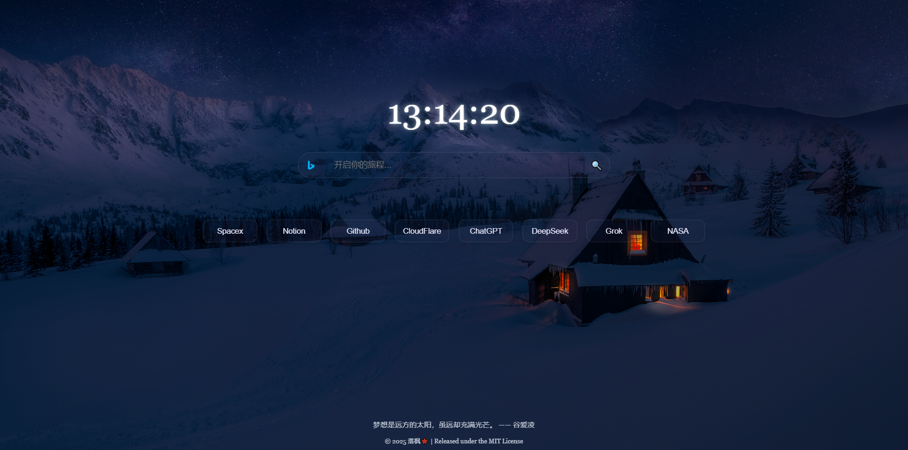

# 🍁 Falling Maple Start Page

[中文版](./README.md)

A sleek and elegant browser start page, integrating powerful search functionality and common navigation links to significantly boost daily browsing efficiency. Built with pure static web design, it’s ready to use out of the box, supports multi-engine search, and features responsive layouts with customizable shortcuts, perfectly adapting to personal habits. Lightweight, flexible, and highly customizable, it makes your online experience more efficient and comfortable—give it a try!

## Features

- **Dynamic Clock**: Displays the current time with a zoom effect on hover.
- **Multi-Engine Search**: Supports Google, Wikipedia, YouTube, Bilibili, and more.
- **Shortcuts**:
  - `Alt + 1` to `Alt + 0`: Switch between search engines.
  - `Enter`: Triggers search quickly when not focused.
- **Navigation Buttons**: Quick access to common tools (Notion, GitHub Trending, etc.).
- **Hitokoto Quote**: Displays a random quote at the bottom.
- **Responsive Design**: Adapts to desktop and mobile (including iPhone 4S).

## Preview

## Usage

### Local Use:

1. Download the project folder.
2. Open `index.html` to start using it.

### Deployment:

1. Upload to a static hosting service (e.g., GitHub Pages, Vercel).
2. Access `index.html` from the root directory.

### Online Use:

- [Try it online](https://hwdpw.github.io/startpage/)

## Installation & Configuration

- No additional dependencies required—just run it directly.
- Customizable options:
  - Edit search options and navigation buttons in `index.html`.
  - Adjust styles in `style.css`.
  - Update search engine URLs or shortcut logic in `script.js`.

## Tech Stack

- **HTML5**
- **CSS3** (Flexbox, Animations)
- **JavaScript** (DOM Manipulation, Fetch API)

## Copyright & License

© 2025 Falling Maple 🍁  
This project follows the [MIT License](LICENSE), embracing the spirit of open source. Feel free to use, explore, and share it. If reposting or distributing, please credit the [original project](https://github.com/hwdpw/startpage)—much appreciated!  
Every line of code is crafted with heart and passion. If you find even a hint of beauty in it, consider giving it a Star—your support is the spark that keeps me going.  
For generous souls, feel free to visit my [Personal World](https://hwd.pw)—a cup of tea or a kind word means the world to me.

## Contribution

- Submit Issues or Pull Requests to [GitHub repository](https://github.com/hwdpw/startpage).
- Contact: hwdpw@outlook.com

## Acknowledgments

- Hitokoto API: https://hitokoto.cn/
- Search Icons: https://www.iconfont.cn/
- Background Image: https://www.peakpx.com/
