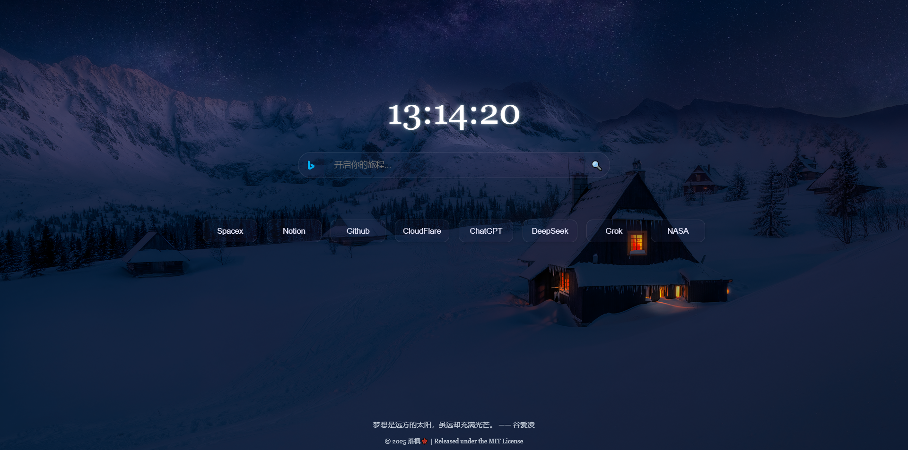

# 🍁 落枫起始页

一个简洁优雅的浏览器起始页，集成了搜索功能和常用导航，旨在提升日常浏览效率。

## 功能

- **动态时钟**：显示当前时间，鼠标悬停放大效果。
- **多引擎搜索**：支持 Google、Wiki、YouTube、Bilibili...。
- **快捷键**：
  - `Alt + 1` 到 `Alt + 0`：切换搜索引擎。
  - `Enter`：未聚焦时快速触发搜索。
- **导航按钮**：快速访问常用工具（Notion、Github Trending 等）。
- **一言引用**：底部显示随机名言。
- **响应式设计**：适配桌面和移动端（包括 iPhone 4S）。

## 预览

## 使用方法

1. **本地使用**：
   - 下载项目文件夹。
   - 打开 `index.html` 即可使用。
2. **部署**：
   - 上传到静态托管服务（如 GitHub Pages、Vercel）。
   - 访问根目录下的 `index.html`。
3. **在线使用**：
   -  [在线使用](https://hwdpw.github.io/startpage/)。

## 安装与配置

- 无需额外依赖，直接运行。
- 可自定义：
  - 修改 `index.html` 中的搜索选项和导航按钮。
  - 调整 `style.css` 中的样式。
  - 更新 `script.js` 中的搜索引擎 URL 或快捷键逻辑。

## 技术栈

- HTML5
- CSS3（Flexbox、动画）
- JavaScript（DOM 操作、Fetch API）

## 版权与许可证

© 2025 落枫 🍁  
本项目秉承 [MIT License](LICENSE) 开源精神，诚邀您自由使用、探索与分享。若转载或传播，烦请标注 [项目原址](https://github.com/hwdpw/startpage)，感激不尽。  
每一行代码，皆凝聚心血与热爱。若您觉得它有一丝美好，不妨点亮一颗 Star，您的支持是我前行的微光。  
若有意慷慨相助，欢迎移步 [Personal World ](https://hwd.pw)，一盏茶、一份鼓励，皆是对我莫大的温暖。

## 贡献

- 提交 Issue 或 Pull Request 到 [GitHub 仓库](https://github.com/hwdpw/startpage)。
- 联系方式：hwdpw@outlook.com。

## 致谢

- 一言 API：https://hitokoto.cn/
- 搜索图标：https://www.iconfont.cn/
- 背景图片：https://www.peakpx.com/
